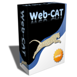

Web-CAT is an advanced automated grading system that can grade students on
how well they test their own code. It is free, open-source software. It is
highly customizable and extensible, and supports virtually any model of
program grading, assessment, and feedback generation. Web-CAT is implemented
a web application with a plug-in-style architecture so that it also can
serve as a platform for providing additional student support services to
help students learn programming or software testing. Some of its key
features:

<ul style="clear:left;">
<li>Customizable and extensible</li>
<li>Plug-in-style architecture</li>
<li>Supports student-written tests, measurement of test coverage, and
  grading on test thoroughness</li>
<li>Supports static analysis tools to assess documentation and coding
  style</li>
<li>Supports manual grading with direct on-line markup of assignments</li>
</ul>

This is the on-line home for users and developers of Web-CAT. Ask questions,
get support, contribute to development, and get involved!

You can find out more through the following pages:

<ul>
<li>
<a href="Cookbook.html">Web-CAT Cookbook</a>: the
  community-maintained documentation for Web-CAT
</li>
<li>
<a href="WhatIsWebCat.html">WhatIsWebCat</a>
</li>
<li>
<strong>Movie:</strong> <a href="SubmissionWalkthrough.html">SubmissionWalkthrough</a> (24Mb, 5min)
</li>
<li>
<a href="WebCatFeatures/html">WebCatFeatures</a>
</li>
<li>
<a href="WebCatFaq.html">WebCatFaq</a> (frequently asked questions)
</li>
<li>
Several other movies are available in the
  <a href="Cookbook.html">Web-CAT Cookbook</a>
</li>
</ul>
